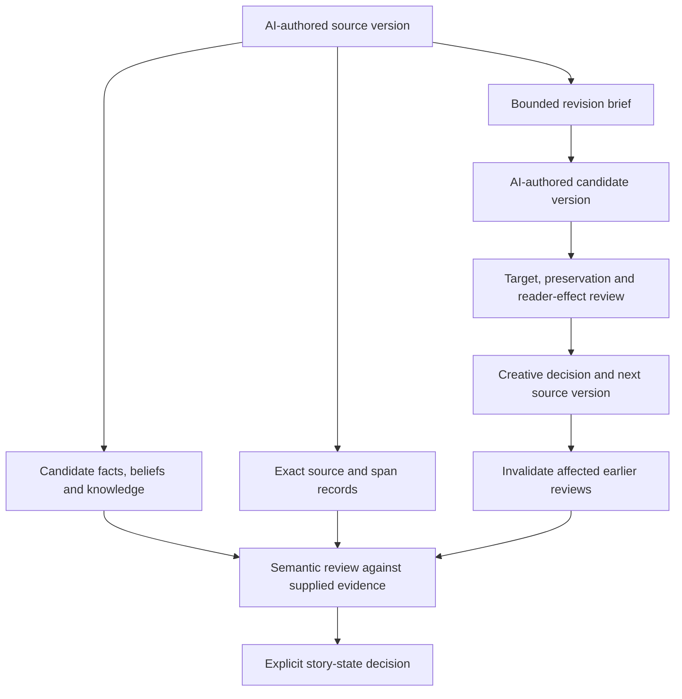

# Writing system: useful controls and open questions

Updated 4 October 2026. The private research lab's source, state and editorial prototypes informed the completed manuscript workflow. The 22-chapter novel has now been drafted, read in full, cross-reviewed, revised and exported. The public project uses source manifests, explicit handoffs and actual repair verification; it does not claim every private prototype was used in production. A passing mechanical check does not establish literary quality or a true interpretation of a passage.

The arrows describe separate operations, not one automatic transaction. In particular, an authentic quotation cannot by itself move an extracted statement into accepted story state. A review's judgment and its source linkage are different records. Changes to the task or supplied context can make a review stale even if the quoted sentence survives unchanged.

| Capability | Implemented in the private lab | What still needs evidence |
| --- | --- | --- |
| Narrative state | World, belief, knowledge, branch and partial-order declarations; structural conflict checks | Accurate extraction and useful review effort across an actual book |
| Source history | Immutable identities, exact spans, persistent active heads and stale dependency queues | Complete enough declared dependencies without excessive review work |
| Editorial records | Separate diagnosis, proposed action, applied candidate, preservation and aesthetic assessment | Better actual revisions and reader experience |
| Evidence assessment | Direct and typed local judgments, exact quotation checks, explicit unknown/conflicting outcomes | Reliable inference across fresh source families; confidence is not acceptance |
| Comparison preparation | Frozen source sets, bounded runs, retained failures and reader-packet controls | Human reading evidence and full-book payoff |

## Use it during writing

Start with a creative brief whose aims are specific to the chosen book. Draft in coherent scenes and chapters, preserving every version and the actual AI authoring method. Record human directions separately from manuscript wording. Extract only the state needed for subsequent action: who did what, when, what others could know, and which claims are merely beliefs or possibilities.

Review structural problems before sentence cleanup. Give a proposed repair a concrete target and preservation constraints, then inspect the actual resulting prose. Recheck the edited paragraph as well as untouched material: a repair can solve one problem while introducing another nearby. Preserve a purposeful ambiguity instead of supplying a convenient fact that the story has not established.

Keep the writing process proportionate. We do not need a machine declaration for every sentence, and a registry of declarations cannot replace reading consecutive chapters. Track the cost of review alongside defects caught. Drop machinery that consumes writing time without protecting an important commitment.

## Decisions we have not delegated to scores

The user selected *The Fifteenth Year*. The resulting 44,552-word novel follows the adopted [creative brief](../book/brief/creative-brief.md), including its irreversible ending. The earlier four-opening reader packet still has no collected responses; the user's direct selection is recorded separately. Local model agreement did not choose the book. [Final editorial records](../book/reviews/final-editorial-status.json) describe actual scope and shared-context limits.

The completed [evidence-window study](../research/notes/2026-10-03-evidence-window-results.md) showed why full-source agreement and support from the supplied excerpt must be separated. The [revision evidence](../research/notes/2026-10-03-revision-evidence.md) similarly separates an apparently reasonable edit decision from a successful repair. These results inform the controls above; neither establishes a universal editing rule.

Implementation and current limits are recorded in the private [research lab](https://github.com/odinfree/thelyson-research-lab). Generalized contributions to the public Stop Slop skill follow its [evidence-led transfer plan](../integrations/stop-slop-refined/roadmap.md), with original public fixtures and a fresh review of the upstream baseline.
