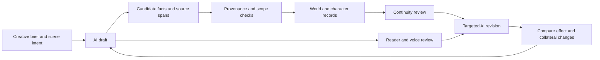

# October research campaign: current direction

Checked 3 October 2026. This is a targeted primary-source synthesis and an early implementation checkpoint. It updates the initial six-paper review. It does not establish that our method beats published systems or predicts the contest winner.

## The frontier includes novel-length experiments

Two September preprints materially change the initial picture:

| Study | What was actually evaluated | Important limit | Hypothesis worth testing |
| --- | --- | --- | --- |
| [NstAgent: Scaling Long-Form Story Generation via Narrative State Tracking](https://arxiv.org/html/2609.35759v1), 28 September | Structured state versus rolling summaries at 10K–100K-word targets; reported achieved means near 100K at the largest target | Main evaluation uses model judges. Incorrect updates can preserve errors. Selected-window consistency checks are not exhaustive annotation of a novel. | Preserve explicit state, but require evidence before accepting an update. |
| [NarraWorld: Shared Worlds, Private Minds](https://arxiv.org/html/2609.32401v1), 26 September | Separate world facts, beliefs and possibilities; a small human sample includes 15 complete 14-chapter stories | 42K is the target, not an independently measured mean. Full-context writing leads some human dimensions; automated and human judgments diverge. | Isolate character perspectives and imagined branches without assuming more structure always helps. |

Novel-length generation has therefore been reported. General reader preference, distinctive voice, and transfer to this contest remain open questions. A new preprint is a source of testable ideas, not a verified winning system.

## Proposed architecture

Keep three kinds of material distinct: the manuscript, explicit narrative declarations, and evidence that supports those declarations.

The records must distinguish:

- **Story time and presentation order:** a flashback can appear later without occurring later.
- **World facts, acquired knowledge and belief:** a character's mistaken belief may be deliberate, and remembered information may become stale.
- **Actual and imagined events:** a possibility must not silently become canon.
- **Unknown and false:** absence of evidence must remain unresolved.
- **A correct quotation and a correct interpretation:** a real source span can still be misread.

The first deterministic checker operates on supplied declarations. It cannot extract a story's meaning or certify prose quality. This narrower boundary is useful: it lets us test ordering and state mechanics without pretending those tests validate a novel.

## What early tests establish

The private laboratory has isolated contest, narrative-system and evaluation workflows. At this checkpoint:

- The narrative checker passed 16 independently frozen synthetic cases. A separate review then found two missing cases: indirect conflicting timestamps and an initial-state identifier collision. Both were fixed and retained as regressions.
- The typed Jev evidence classifier matched 12 independent known-answer cases in both option orders, with no label flips. These 24 calls test short evidence relations, not long-context reading, calibrated literary judgment or reader preference.
- The integrated implementation has 55 passing deterministic tests. Further work is testing source-span grounding before relying on extracted state.

These counts describe our fixtures. They do not establish population accuracy, contest scores, originality, or an advantage over published methods. Independent review remains necessary even after every existing test passes.

## Research findings we will not promote into rules

An Elicit review retrieved 200 records, screened 113 at full-text stage and extracted 55. Neither September preprint appeared in its retrieved set. A targeted primary-source audit also found synthesis errors: conflated STORYTELLER ablations, inconsistent PLOTTER cost arithmetic, and an error-count/error-density confusion. Elicit is useful for discovery; its generated summary needs verification against tables and methods.

[STORYTELLER](https://arxiv.org/html/2506.02347) supports testing graph and review components separately; unequal output lengths complicate cross-system preferences. [PLOTTER](https://arxiv.org/html/2604.21253) motivates a stopping-rule experiment, but revision depth also changes output scale. Neither supplies our production budget.

[ConStory-Bench](https://arxiv.org/html/2603.05890) motivates evidence-grounded consistency checks. Error counts and error density must be reported separately, and its positional observations do not validate automatic rewriting of the middle of a book. [Finding Flawed Fictions](https://arxiv.org/html/2504.11900v1) shows that detecting plot holes remains difficult even in much shorter stories; model certainty is insufficient evidence for a repair.

## Next comparisons

1. Compare direct reading, rolling summaries and structured state on the same original passages and known-answer queries. Hold source material and output allowance fixed; record missed errors and false alarms.
2. Test extraction with false beliefs, rumors, flashbacks, ambiguity and imagined branches. Preserve the exact source and revision for every proposed fact.
3. Compare targeted revision with the original in context. Check the intended improvement, semantic changes and damage to voice separately. Stop when the next revision cannot demonstrate a benefit.
4. Use paired keep/repair examples for fiction editing. A literal word, purposeful repetition, unknown actor or distinctive character voice must survive when it serves the passage.
5. Evaluate why someone would continue reading and whether later consequences repay early attention. This requires actual reader evidence; a coherent state graph cannot answer it.

These are research designs, not measured improvements. No premise, genre, title or manuscript has been selected. The existing [Stop Slop contribution plan](../../integrations/stop-slop-refined/roadmap.md) remains the route for transferring tested, general lessons.
